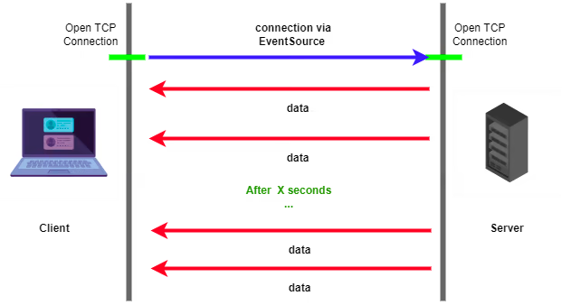
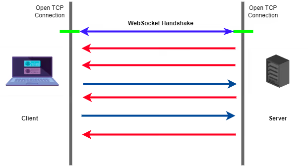

# SSE vs WebSocket

## 등장 배경

- HTTP request-response 모델의 한계
    - 서버 클라이언트 모두 connection을 발행해야하고, request-response 사이클이 한번 끝나면 해당 커넥션은 종료가 됨
    - static 컨텐츠만 표시할 때에는 상관이 없지만, 웹 버전이 발전할수록 client요청 없이 server가 먼저 데이터를 보내줘야하는 경우가 생김 (단방향 통신의 한계)
    - push technology 스타일 등장
        - 인터넷 기반의 통신방식으로, 서버로부터 요청이 시작되는 통신 가능

## WebSocket

- 양방향 전이중 통신을 수행하기 위한 프로토콜 제공
- 클라이언트가 요청하지 않아도 서버에서 알아서 클라이언트로 데이터를 보내줌
-

## SSE

- 개념 및 특징
    - Server-Sent Events
    - 단방향 통신 (서버에서 클라이언트로 데이터를 보냄)
    - 주로 서버에서 클라이언트에게 데이터를 보내는 (Push) 위주의 작업에서 유용하게 사용될 수 있음
    - 서버에 의행 생성된 업데이트 스트림을 구독하고 새 이벤트가 발생할 때마다 클라이언트에 알림을 보내는 개념
    - 웹소켓과 같은 양방향이 아니기 때문에 서버에 보낼때에는 Ajax를 주로 활용
    - [Topic 기반 데이터 구독도 가능](https://boxfoxs.tistory.com/403)
- 장점
    - websocket과 달리 별도의 프로토콜을 사용하지 않고 HTTP 프로토콜만으로 사용이 가능하며 훨씬 가볍다.
    - 재접속 처리 같은 대부분의 저수준 처리가 자동으로 됨
    - IE를 제외한 대부분의 브라우저 지원
    - HTML과 JavaScript만으로 구현할 수 있으므로 현재 지원되지 않는 브라우저(IE 포함)도 polyfill을 이용해 크로스 브라우징 가능

- 가장 큰 차이점은 통신 방향. 웹소켓은 양방향, sse는 단방향이기 때문에 클라이언트가 데이터를 보낼 필요가 있을 때는 소켓, 아닐때 sse 유리

- sse

  

- websocket

  

## 언제 쓸까?

- 리얼타임이 필요하고, 양방향으로 통신해야하는 경우 WebSocket을 사용하자
- 알람과 같이 데이터를 받기만 해도 되고, 프로토콜이나 따로 서버 구현을 하고 싶지 않을 때, 가볍게 쓰고 싶을 때 SSE를 쓰자

## 결론

- 최초에 여러장 이미지를 API에게 보내놓고, 분석 끝날때마다 하나하나씩 클라이언트에게 결과를 보여주는 이미지 분석 API 개발에는 SSE가 더 적합할 것 같다
- 또한 HTTP 메서드를 그대로 쓰고, FE는 JavaScript에서 요청할 수 있고, BE는 Java Servlet 그대로 쓸 수 있어서 도입하기도 상대적으로 쉬울 것 같다.
- 어차피 우리 서비스는 Chrome만 지원하기 때문에 IE가 미지원 되는 단점은 중요하지 않다.

- 참고
    - [https://jobtc.tistory.com/59](https://jobtc.tistory.com/59)
    - [https://hamait.tistory.com/792](https://hamait.tistory.com/792)
    - [https://velog.io/@y1andyu/웹-소켓-SSE란-무엇일까](https://velog.io/@y1andyu/%EC%9B%B9-%EC%86%8C%EC%BC%93-SSE%EB%9E%80-%EB%AC%B4%EC%97%87%EC%9D%BC%EA%B9%8C)
    - [https://surviveasdev.tistory.com/entry/웹소켓-과-SSEServer-Sent-Event-차이점-알아보고-사용해보기](https://surviveasdev.tistory.com/entry/%EC%9B%B9%EC%86%8C%EC%BC%93-%EA%B3%BC-SSEServer-Sent-Event-%EC%B0%A8%EC%9D%B4%EC%A0%90-%EC%95%8C%EC%95%84%EB%B3%B4%EA%B3%A0-%EC%82%AC%EC%9A%A9%ED%95%B4%EB%B3%B4%EA%B8%B0)
    - [https://boxfoxs.tistory.com/403](https://boxfoxs.tistory.com/403)