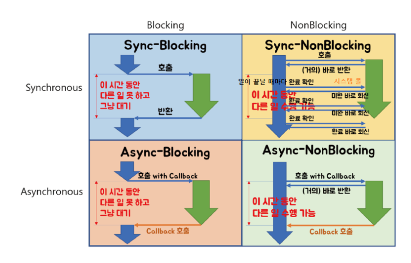

# 동기/비동기, 블로킹/넌블로킹

## 용어

- 제어권: 자신의 함수를 실행할 권리. 제어권을 가진 함수는 자신의 코드를 끝까지 실행한 후 자신을 호출한 함수에게 돌려줌
- 결과값을 기다리는 것: A 함수에서 B 함수를 호출했을 때 A 함수가 B 함수의 결과값을 기다리느냐 여부

## Blocking, Non-Blocking

A함수에서 B함수를 호출했다고 하자

| 구분 | Blocking | Non-Blocking |
| --- | --- | --- |
| 제어권 | B에게 제어권을 넘겨주고, B 실행이 끝나면 A에게 제어권을 넘겨줌 | A함수가 그대로 제어권을 가지고 있는다 |
| B함수 실행될동안 A는? | B함수 실행 끝날때까지 정지 | B가 실행되는 중에도 A 계속 실행 |

## Synchronous(동기) vs Asynchronous(비동기)

| 구분 | Synchronous | Asynchronous |
| --- | --- | --- |
| 호출되는 함수의 작업 완료를 신경쓰는가? | yes | no |
| 어떻게? | B함수의 리턴값 확인 필요 | B를 호출할 때 콜백 함수를 함께 전달해서 함수 B 완료되면 콜백함수가 실행됨 |

## 조합

|  | Blocking | Non-Blocking |
| --- | --- | --- |
| Synchronous | - A → B 호출 - B 끝날때까지 A 정지 - B 완료되면 값 리턴 - 리턴값 받아서 A 실행 재개 | - A → B 호출 - B 실행되는 와중에도 A 실행 - A 처리에 B 값 필요하니깐 중간 중간 B에게 실행완료했는지 계속 계속 call 함 - B 결과 받아서 A 실행 |
  | Asynchronous | - A → B 호출하는데 리턴값 신경쓰지 않고 콜백 함수를 보냄 - A는 B 값 상관 없지만 B 끝날때까지 기다림 - B는 끝나고 콜백함수 실행 `사용하는 경우 거의 없음` | - A → B 호출 - B가 실행되는 와중에도 A 실행 - A는 B 신경 안씀 - B 끝나면 콜백 함수 실행 |