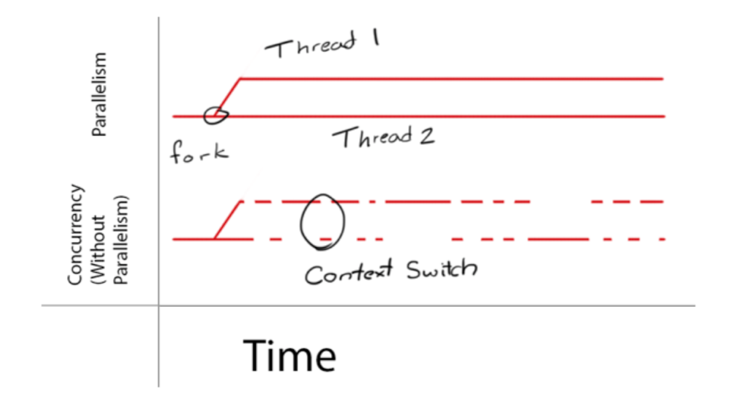

# 비동기와 병렬, 넌블로킹

## Blocking, Non-Blocking

A함수에서 B함수를 호출했다고 하자

| 구분 | Blocking | Non-Blocking |
| --- | --- | --- |
| 제어권 | B에게 제어권을 넘겨주고, B 실행이 끝나면 A에게 제어권을 넘겨줌 | A함수가 그대로 제어권을 가지고 있는다 |
| B함수 실행될동안 A는? | B함수 실행 끝날때까지 정지 | B가 실행되는 중에도 A 계속 실행 |

## Synchronous(동기) vs Asynchronous(비동기)

| 구분 | Synchronous | Asynchronous |
| --- | --- | --- |
| 호출되는 함수의 작업 완료를 신경쓰는가? | yes | no |
| 어떻게? | B함수의 리턴값 확인 필요 | B를 호출할 때 콜백 함수를 함께 전달해서 함수 B 완료되면 콜백함수가 실행됨 |

## 물리적 스레드 vs 논리적 스레드

| 구분 | 물리적 스레드 | 논리적 스레드 |
| --- | --- | --- |
| 개념 | 물리적 코어를 논리적으로 쪼갠 코어 | - 동시성을 가짐
- 병렬적으로 실행되는것 같지만 여러 작업이 번갈아가면서 처리되어 병렬적으로 처리되는것 같아 보임 |
| example | 4코어 8스레드, 6코어 12스레드… |  |

## 동시성 vs 병렬성

- **동시성 (Concurrency)**
    - 논리적 개념
    - 여러 작업이 번갈아가면서 처리
    - 싱글코어. 멀티코어에서 모두 동작 가능
    - 하나의 cpu에서 동시에 여러 작업을 하는것처럼 보임
    - 무엇을 언제 할지 분리

- **병렬성(Parallelism)**
    - 물리적 개념
    - 물리적으로 멀티 코어가 병렬적으로 실행
    - 한개 이상의 스레드를 포함하는 각 코어들이 동시에 실행

