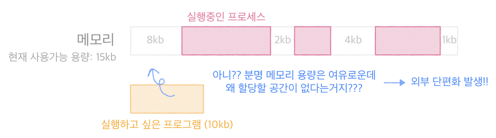

## 메모리 단편화란?

- 주기억장치(CPU가 직접 접근하여 처리할 수 있는 고속의 기억장치)에서 메모리 공간이 작은 조각으로 나뉘어져 사용가능한 메모리가 충분히 존재하지만 할당이 불간으한 상태
- 내부단편화(Internal Fragmentation)
    - 메모리 할당할 때 프로세스가 필요로 하는 크기보다 더 크게 할당되어서 공간이 낭비되는 경우
  

- 외부 단편화(External Fragmentation)
    - 메모리가 할당되고 해제되는 작업이 반복되면서 중간중간 작은 메모리가 존재하는데, 총 메모리 공간은 여유가 있지만, 여유 메모리들이 중간 중간에 분포해 실제로 프로세스를 할당할 수 없는 상태

  

## 메모리풀

- 외부 단편화, 내부 단편화 해결
- 필요한 메모리 공간을 필요한 크기, 개수만큼 사용자가 직접 지정하여 미리 할당받아놓고 필요할 때마다 사용하고 반납하는 기법
- Java에서는 사용자가 관리 안해도 JVM에서 관리해줌

## 자바 메모리 (JVM) 영역

- C나 C++로 개발할 때에는 메모리에 할당하고 해제하는 것을 사용자가 직접 해야했다
- Java에서는 GC(Garbage Collector)가 해준다