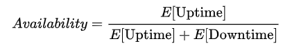

## 가용성(Availability)

- 서버와 네트워크 또는 프로그램 등의 다양한 정보 시스템이 정상적으로 사용가능한 정도
- 시스템 가동률과 비슷
- 수식

## 고가용성

- 가용성이 몹시 높은 시스템
- 즉, 장애 없이 오랜 시간동안 정상 운영

## 고가용성을 구현하기 위한 대표적인 방법

- 고가용성 솔루션을 이용하여 각 시스템들을 클러스터로 엮음. 서버 장애시 클러스터의 다른 서버가 업무 대신함
- 네트워크 연결의 이중화 - 네트워크 회선을 단일로 쓰지 않고 하나가 사용 불가능시 다른 회선 사용
- LAG(Link Aggregation Group) - 물리적인 회선을 이중화 (Active/Standby)
- 로드밸런서 - 네트워크 트래픽을 살아있는 서버로 분산시켜줌
- RAID 방식의 스토리지 - 여러 디스크에 같은 내용을 복제해둬서 하나의 디스크 장애시 다른 디스크에 저장된 정보 불러옴