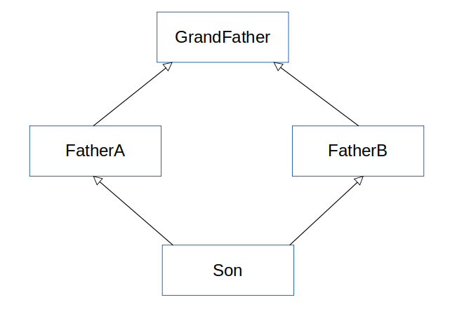

# 자바 다중상속 안되는 이유(다이아몬드 문제)

## 다중 상속 가능할 경우 생기는 다이아몬드 문제

- Son은 FatherA와 Father B 를 다중상속 받았음
- FatherA와 FatherB 모두 talk() 라는 메서드가 있다고 하자
- Son 입장에서는 어떤 부모의 talk() 메서드를 사용해야할까 → 충돌이 일어남

## 인터페이스는 가능하다

- 인터페이스는 기능에 대한 선언만 해두면 되기 때문에 다중 상속이 되더라도 충돌할 여지가 없다

## 자바8의 default method

- 자바8의 interface에서는 default method가 추가되어 메서드 구현이 가능하다.
- 이런 interface의 경우 마치 class처럼 다중 상속을 받을 수 없다(컴파일 에러 발생)

- 참고

  [https://siyoon210.tistory.com/125](https://siyoon210.tistory.com/125)