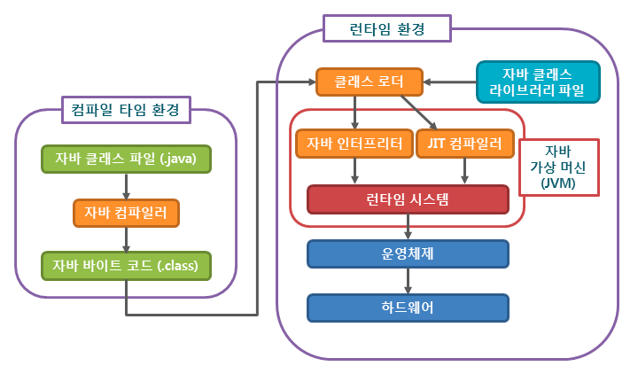
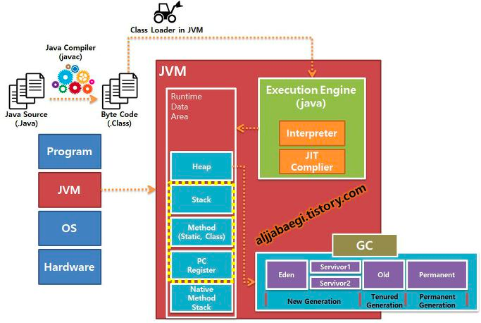

# 자바 컴파일 과정

## JVM이란?

- Java Virtual Machine
- OS에 종속받지 않고 CPU가 Java를 인식해서 실행할 수 있게 하는 가상 컴퓨터

1. 개발자가 자바 `소스코드(.java)` 작성
2. Java Compiler가 `바이트 코드(.class)`로 컴파일  —> JVM이 이해할 수 있는 상태
3. JVM 클래스 로더가 바이트코드를 `런타임 데이터 영역`에 올림 → JVM 메모리에 올림
    1. 클래스 로더 세부 동작
        1. 로드:  JVM 메모리에 로드
        2. 검증 : 자바 언어 명세 및 JVM 명세에 명시된대로 구성되어 있는지 검사
        3. 준비: 클래스가 필요로 하는 메모리를 할당 (필드, 메서드, 인터페이스..)
        4. 분석: 클래스의 상수 풀 내 모든 심볼릭 레퍼런스를 다이렉트 레퍼런스로 변경
        5. 초기화: 클래스 변수들을 적절한 값으로 초기화 (static 필드)
4. 실행엔진이 JVM에 올라온 바이트 코드들은 `(기계어)`명령어 단위로 가져와서 실행
    1. 인터프리터: 바이트 코드 명령어를 하나씩 읽어서 해석하고 실행. 하나하나 실행은 빠르나 전체적인 실행속도는 느림
    2. JIT 컴파일러 (Just In Time Compiler): 인터프리터 단점 보안. 바이트 코드 전체를 바이너리 코드로 컴파일 한 후 실행. 전체적인 실행속도가 빠르지만 하나하나 실행은 느림)

## JVM을 왜 사용?

- 자바 프로그램이 어떤 OS에서든 실행 가능
- 프로그램 메모리를 관리하고 최적화 해줌