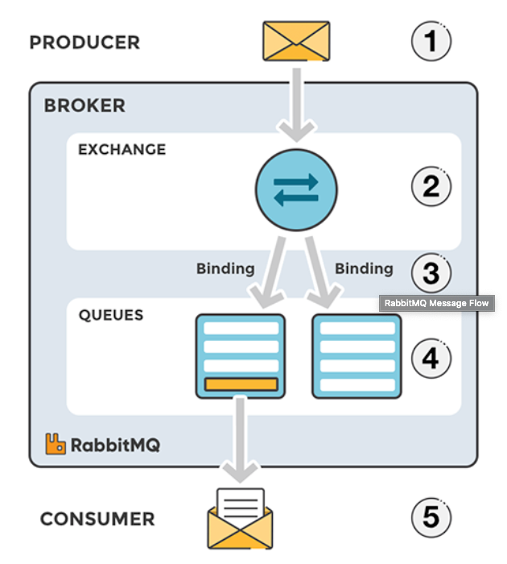
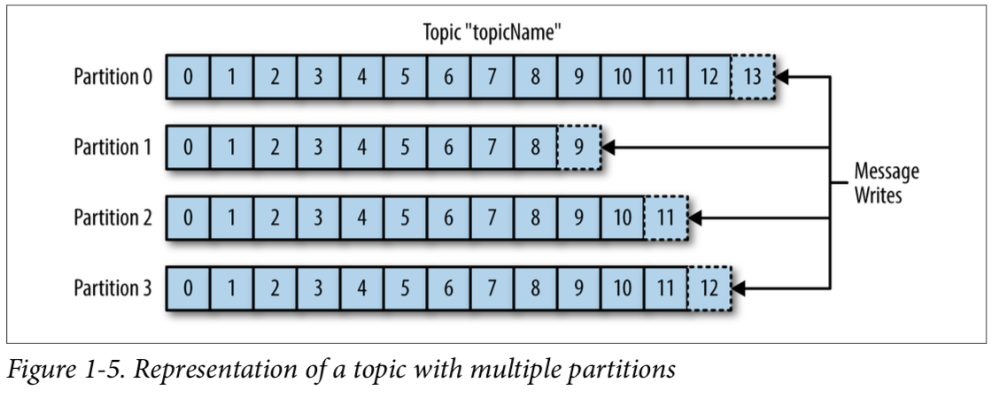
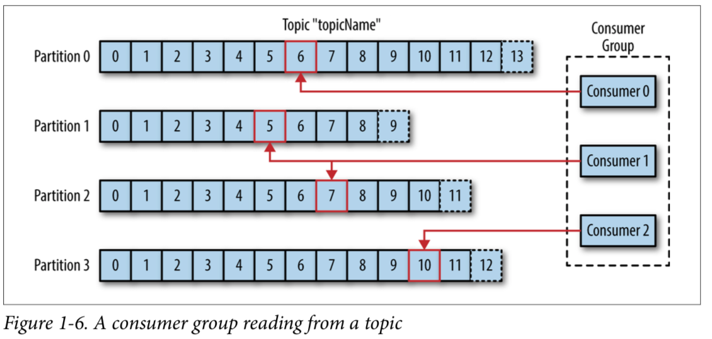

# MQ 비교 (Kafka, RabbitMQ, Redis)

## RabbitMQ

- 개념
    - AMQP를 따르는 오픈소스 메세지

    <aside>
    💡 AMQP(Advanced Message Queuing Protocol):  메세지 지향 미들웨어를 위한 개방형 표준 응용 계층 프로토콜

    </aside>

- 구성 요소
    - producer: 메세지를 보냄
    - exchange: 메세지를 목적지(큐)에 맞게 전달
    - queue: 메세지를 쌓아둠
    - consumer: 메세지를 받음

- 메세지 처리 과정
    - Producer가 메세지를 보내면
    - exchange에서 해당하는 키에 맞게 큐에 분배(바인딩 or 라우팅)
        - topic 모드: Routing Key가 정확히 일치하는 Queue에 메세지 전송 (Unicast)
        - direct 모드: Routing Key 패턴이 일치하는 Queue에 메세지 전송(Multicast)
        - headers 모드: [key:value]로 이루어진 header 값을 기준으로 일치하는 Queue에 메세지 전송 (Multicast)
        - fanout 모드: 해당 Exchange에 등록된 모든 Queue에 메세지 전송 (Broadcast)
    - 해당 큐에서 consumer가 메세지를 받음
- 특징
    - MQ server가 종료 후 재기동 하면 기본적으로 Queue 내용은 모두 제거됨

## Kafka

- 개념
    - pub-sub 모델의 메세지 큐
    - 분산 환경에 특화되어 있는 특징
    - RabbitMQ와 같은 다른 메세지 큐보다 빠르다
    - 클러스터 구성, fail-over, replication과 같은 기능이 있음
- 구성 요소
    - Event: kafka에서 producer 와 consumer가 데이터를 주고받는 단위. 메세지
    - Producer: kafka에 이벤트를 게시(post, pop)하는 클라이언트 어플리케이션
    - Consumer: Topic을 구독하고 이로부터 얻어낸 이벤트를 받아(Sub) 처리하는 클라이언트 어플리케이션
    - Topic: 이벤트가 모이는 곳. producer는 topic에 이벤트를 게시하고, consumer는 topic을 구독해 이로부터 이벤트를 가져와 처리. 게시판 같은 개념
    - Partition: Topic은 여러 Broker에 분산되어 저장되며, 이렇게 분산된 topic을 partition이라고 함
    - Zoopeeper: 분산 메세지의 큐의 정보를 관리

- 왜 하나의 토픽에 여러개의 파티션을 나눠서 메세지(이벤트)를 쓸까?
    - 카프카의 토픽에 메세지가 쓰여지는 것도 어느정도 시간이 소비된다. 몇 천 건의 메세지가 동시에 카프카에 write되면 병목 현상이 발생할 수 있다.
    - 따라서 파티션을 여러개 두어서 분산 저장함으로써 write 동작을 병렬로 처리할 수 있다.
    - 다만 한번 늘린 파티션은 절대 줄일 수 없기 때문에 운영중에, 파티션을 늘려야 하는건 충분히 고려해서 실행해야한다
    - 파티션을 늘렸을 때 메세지가 round-robin 방식으로 쓰여진다. 따라서 메세지의 서가 보장되지 않는다.
- Fail-over시 마지막 위치부터 다시 메세지 불러올 수 있다
    - 각 파티현에 존재하는 offset의 위치를 통해 이전에 소비했던 offset위치를 기억하고 관리한다.
    - 따라서 Consumer가 죽었다가 다시 살아나도 전에 마지막으로 읽었던 위치에서부터 다시 읽어들일 수 있다.

- consumer 그룹이 왜 존재할까?
    - consumer의 묶음을 consumer group이라고 한다
    - 컨슈머 그룹은 하나의 topic에 대한 책임을 갖고 있다.
    - 즉 어떤 consumer가 down된다면, 파티션 재조정(리밸런싱)을 통해 다른 컨슈머가 해당 파티션의 sub을 맡아서 한다.  offset 정보를 그룹간에 공유하고 있기 때문에 down 되기 전 마지막으로 읽었던 메세지 위치부터 시작한다

## Redis Pub/Sub

- 개념
    - Redis에서 제공하는 MQ
- 구성요소
    - publisher: 메세지를 게시(pub)
    - channel: 메세지를 쌓아두는 queue
    - subscriber: 메세지를 구독(sub)
- 동작
    - pusblisher가 channel에 메세지 게시
    - 해당 채널을 구독하고 있는 subscriber가 메세지를 sub해서 처리함
- 특징
    - channel은 이벤트를 저장하지 않음.
    - channel에 이벤트가 도착 했을 때 해당 채널의 subscriber가 존재하지 않는다면 이벤트가 사라짐
    - subscriber는 동시에 여러 channel을 구독할 수 있으며, 특정한 channel을 지정하지 않고 패턴을 설정하여 해당 패턴에 맞는 채널을 구독할 수 있다

## 비교

|  | RabbitMQ | Kafka | Redis Pub/Sub |
| --- | --- | --- | --- |
| 이벤트 저장
in Queue | 메세지가 성공적으로 전달되었다고 판단될 경우 메세지가 큐에서 삭제되기 때문에 재처리가 어렵다 | 이벤트를 삭제하지 않고 스트림에 저장함으로 영속성(durability)이 보장되고, 재처리가 가능하다. | 저장하지 않음. 심지어 channel에 이벤트가 도착했을 때 해당 채널의 subscriber가 존재하지 않으면 이벤트 사라짐 |
| 프로토콜 | AMQP, MQTT, STOMP 등 여러 메세징 플랫폼을 지원한다. | 단순한 메시지 헤더를 지닌TCP 기반 custom 프로토콜을 사용하기 때문에 대체가 어렵다. | RESP (Redis Serialization Protocol) - TCP 통신 |
| 라우팅  | Direct, Fanout, Topic, Headers의 라우팅 옵션을 제공하여 유연한 라우팅이 가능하다. | 기본기능으로 라우팅에 대해서 지원하지 않는다. Kafka Streams를 활용하여 동적라우팅을 구현할 수 있다. | - |
| 우선순위 | priority queue를 지원하여 우선 순위에 따라서 처리가 가능하다. | 변경 불가능한 시퀀스 큐로, 한 파티션 내에서는 시간 순서를 보장한다. 하지만 여러 파티션이 병렬로 처리할 때는 시간 순서 보장 못함 | 우선순위 처리는 커녕 이벤트가 도착할 지 보장도 못함 |
| 장점 | - 오래전에 개발되어 제품 성숙도가 크다
- 필요에 따라 동기/비동기식 가능
- 유연한 라우팅
- producer/consumer간의 보장되는 메세지 전달
- Manage UI 기본 제공
- 데이터 처리보단 관리적 측면이나 다양한 기능 구현을 원할 때 사용 | - 이벤트가 전달되어도 삭제하지 않고 스트림에 저장
- 고성능, 고가용성, 분산처리에 효과적
- producer 중심적 (많은 양의 데이터를 병렬 처리) | - channel을 구독하는 모든 subscriber가 이벤트를 받기 때문에 synchronization 문제에서 kafka보다 덜하다
- 미들웨어가 필요 없어서 가볍다 |
  | 단점 | - Kafka 보다 느림 | - 범용 메세징 시스템에서 제공되는 다양한 기능이 제공되지 않음 | - 이벤트 도착 보장을 못함 |

## 결론

- 대용량 데이터 처리, 실시간, 고성능, 고가용성이 필요한 경우, 또는 저장된 이벤트를 기반으로 로그를 추적하고 재처리 하는게 필요한 경우 kafka를 쓰자
- 복잡한 라우팅을 유연하게 처리해야하고, 정확한 요청-응답이 필요한 Application을 쓸 때 또는 트래픽은 작지만 장시간 실행되고 안정적인 백그라운드 작업이 필요한 경우 RabbitMQ를 쓰자.
- 이벤트 데이터를 DB에 저장하기 때문에 굳이 미들웨어에 이벤트를 저장할 필요가 없는 경우, consumer에게 굳이 꼭 알람이 도착해야한다는 보장 없이 알람처럼 push 보내는것만 중요하다면 유지보수가 편한 Redis를 사용하자

- 참고

  [https://junkwon-dev.github.io/graphql/real-time/architecture/reids-graphql-pubsub/](https://junkwon-dev.github.io/graphql/real-time/architecture/reids-graphql-pubsub/)

  [https://co-de.tistory.com/9](https://co-de.tistory.com/9)

  [https://blog.dudaji.com/general/2020/05/25/rabbitmq.html](https://blog.dudaji.com/general/2020/05/25/rabbitmq.html)

  [https://medium.com/@umanking/카프카에-대해서-이야기-하기전에-먼저-data에-대해서-이야기해보자-d2e3ca2f3c2](https://medium.com/@umanking/%EC%B9%B4%ED%94%84%EC%B9%B4%EC%97%90-%EB%8C%80%ED%95%B4%EC%84%9C-%EC%9D%B4%EC%95%BC%EA%B8%B0-%ED%95%98%EA%B8%B0%EC%A0%84%EC%97%90-%EB%A8%BC%EC%A0%80-data%EC%97%90-%EB%8C%80%ED%95%B4%EC%84%9C-%EC%9D%B4%EC%95%BC%EA%B8%B0%ED%95%B4%EB%B3%B4%EC%9E%90-d2e3ca2f3c2)

  [https://velog.io/@_koiil/Kafka-vs.-RabbitMQ-for-Event-Sourcing](https://velog.io/@_koiil/Kafka-vs.-RabbitMQ-for-Event-Sourcing)

  [https://always-kimkim.tistory.com/entry/kafka101-streams](https://always-kimkim.tistory.com/entry/kafka101-streams)

  [https://velog.io/@_koiil/Kafka-vs.-RabbitMQ-for-Event-Sourcing](https://velog.io/@_koiil/Kafka-vs.-RabbitMQ-for-Event-Sourcing)