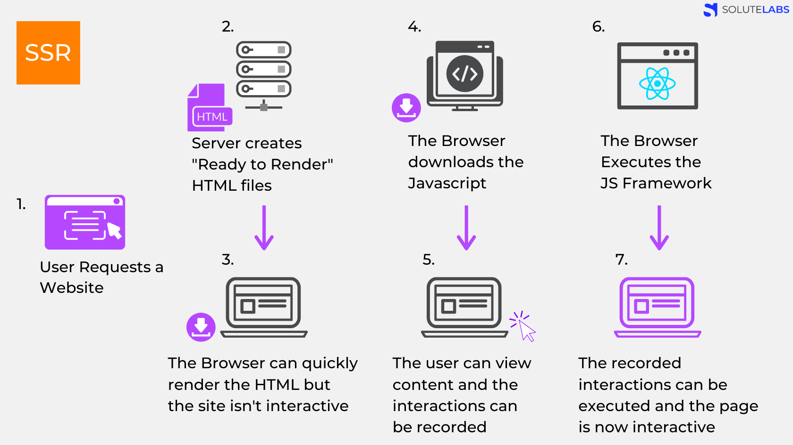
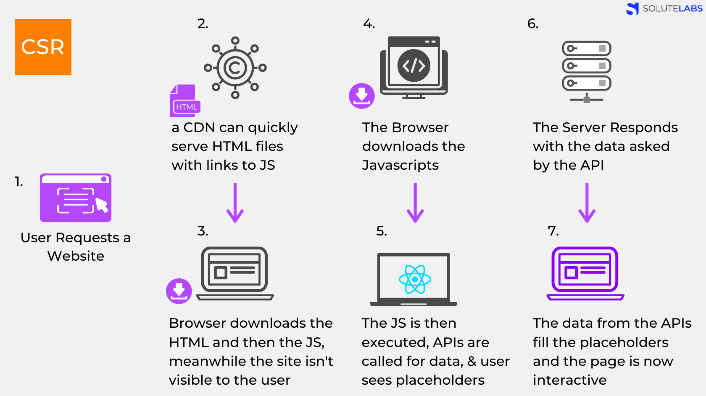

C| 구분 | CSR | SSR |
| --- | --- | --- |
| 개념 | - 클라이언트 쪽에서 렌더링이 일어남
- 서버는 클라이언트의 요청을 받으면 클라이언트에 HTML과 JS를 보내줌. 클라이언트가 받아야 렌더링 시작 | 서버쪽에서 렌더링 준비를 끝마친 상태로 클라이언트에게 전달 |
  | 사용자가 언제부터 볼 수 있나? | - 서버에서 처리 없이 클라이언트에게 보내줌
- 자바스크립트가 모두 다운로드 되고 실행이 끝나기 전까지 사용자는 볼 수 있는게 없음 | 서버에서 이미 렌더가능한 상태로 클라이언트에 전달되기 때문에 JS가 다운로드 되는 동안 사용자는 무언가를 보고있을 수 있다. |
  | 웹페이지 로딩 시간 | - HTML, CSS, 모든 스크립트를 한번에 불러오기 때문에 첫페이지 로딩 느림
- 다른 페이지는 이미 첫 페이지 로딩때 가져와서 빠름 | - 필요한 부분의 HTML과 스크립트만 불러오므로 첫 로딩이 빠름
- 다른 페이지 로딩시 첫 페이지 처럼 필요한 부분 로딩해야해서 느리다 |
  | SEO 대응 (검색 크롤러 대응) | - 자바스크립트를 실행시켜 동적으로 컨텐츠가 생성되기 때문에 자바스크립트가 실행되어야 meta data가 바뀜 | - 애초에 서버에서 컴파일 되어 클라이언트에 넘어오기 때문에 크롤러 대응 용이 |
  | 서버 자원 사용 | 적음 | 서버 자원 사용 많음 (매 페이지 요청) |
  | 문제 발생 상황 | 클라이언트 부하가 너무 많아서 첫 페이지 로딩이 너무 오래걸림 | 리액트 구현시  서버사이드 렌더링을 구현하는데 사용되는 메소드가 있는데, 스택을 막고 동기적으로 처리되어 메소드 실행시 서버를 멈추는 문제  |
  | 언제 쓸까 | - 네트워크 빠를때
- 서버의 성능 낮을때
- 사용자에게 보여줘야할 데이터 많을때
- 메인 스크립트가 가벼울 때
- SEO 상관 X
- 웹 어플리케이션에 사용자와 상호작용 해야할것 많을때  | - 네트워크 느릴때 (느리니 조금씩 자주)
- SEO 필요할떄
- 최초 로딩이 빨라야할 때
- 메인 스크립트 크고 로딩 느릴때
- 웹사이트 상호작용 적을때 |

## SSR 과정

## CSR 과정
