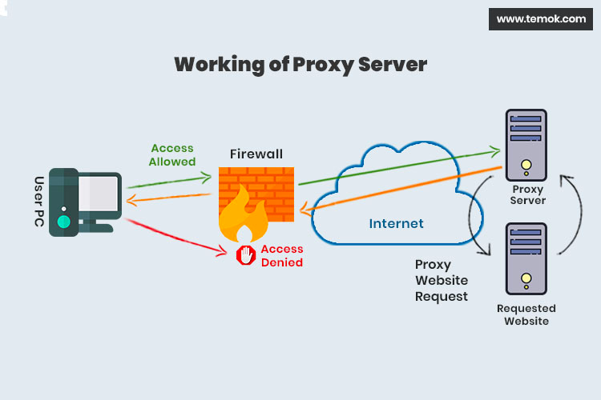
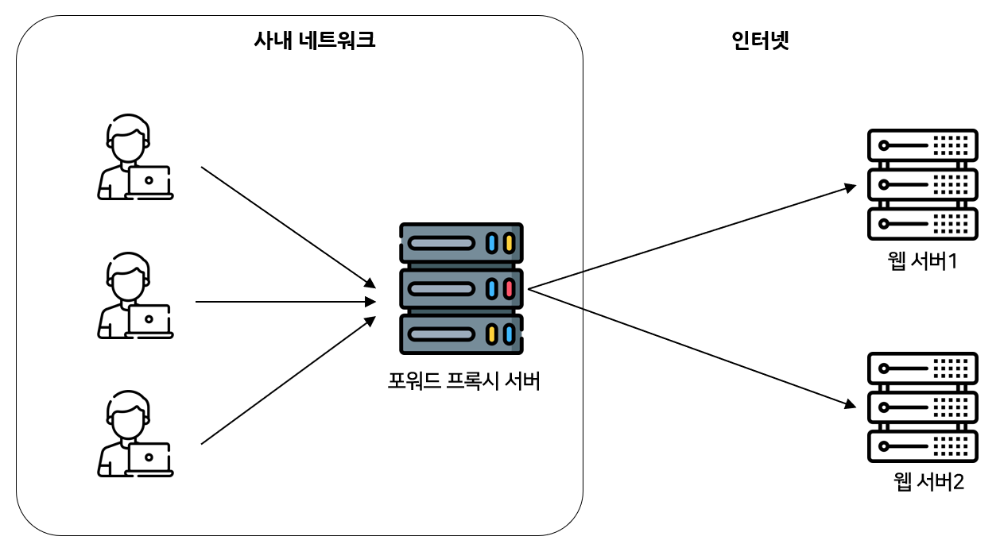
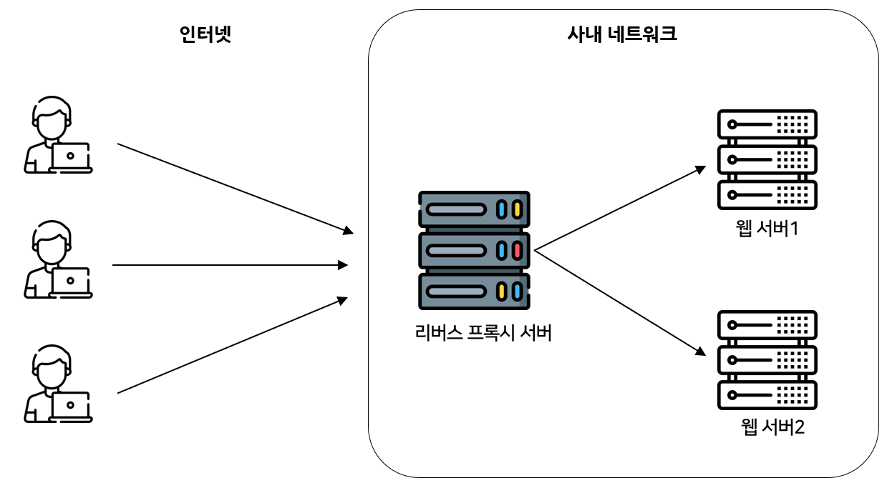

# 프록시 서버

## 프록시 서버

- 클라이언트가 자신을 거쳐 다른 네트워크에 접속할 수 있도록 중간에서 대리해주는 서버
- 왜 사용?
    - 캐시 데이터를 사용하기 위해
        - 프록시 서버에 캐시를 저장해두고, 재요청시에는 서버에 다시 접속할 필요 없이 캐시값을 돌려주는것
        - 전송시간 절약, 외부 트래픽 줄여 네트워크 병목 현상을 줄일 수 있음
    - 보안 목적
        - 프록시 서버 경유하면 IP를 숨기는 것이 가능 → 접속 우회를 한다던가..
        - 프록시 서버를 방화벽으로 사용하기도 하고…

## 리버스 프록시

- 클라이언트 앞에 있는 포워드 프록시와는 다르게 리버스 프록시는 웹서버 앞에 있음
- 왜 사용?
    - 로드밸런싱 (여러대의 서버 앞에 두어 특정 서버가 과부하 되지 않도록)
    - 보안 (클라이언트가 본래 웹서버 1, 2의 IP를 모름) 디도스 공격 막을 수 있음. 대신 CDN과 같은 리버스 프록시 서버가 공격의 타겟이 될 수는 있음
    - 캐시데이터 저장
    - SSL 암호화

